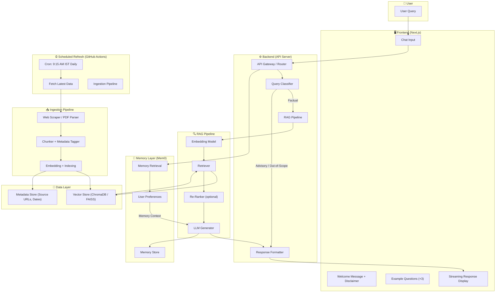
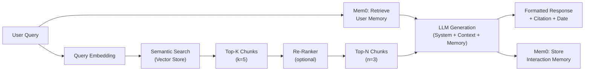
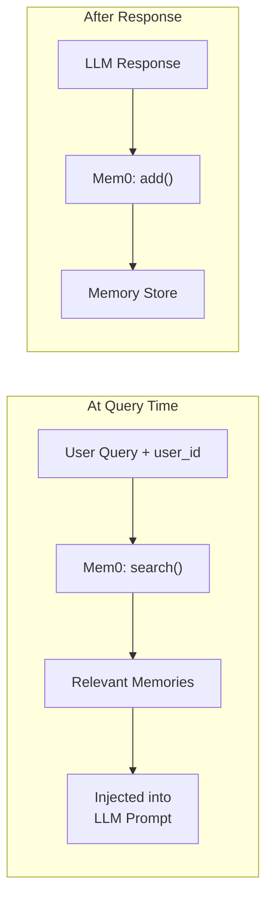
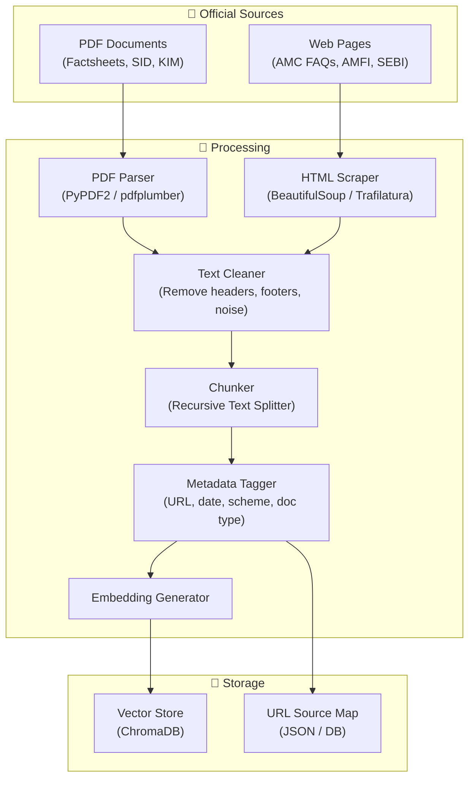
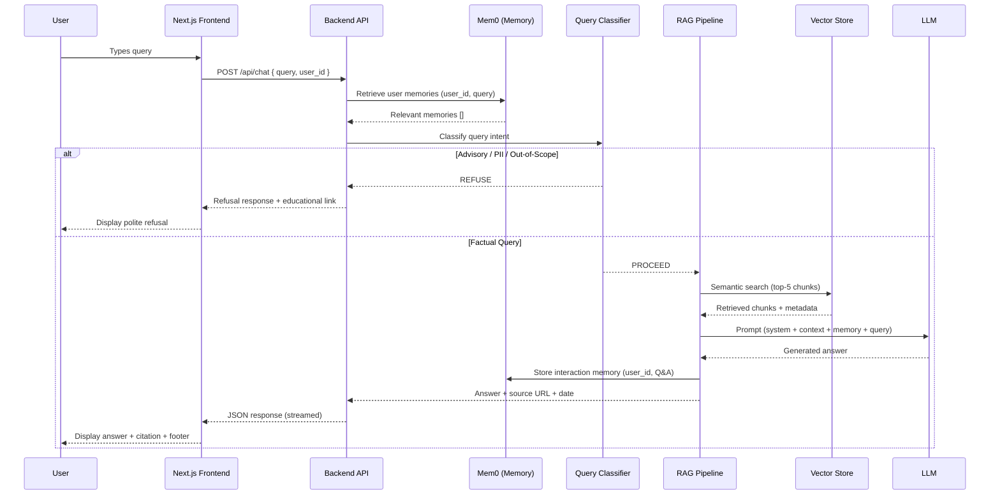
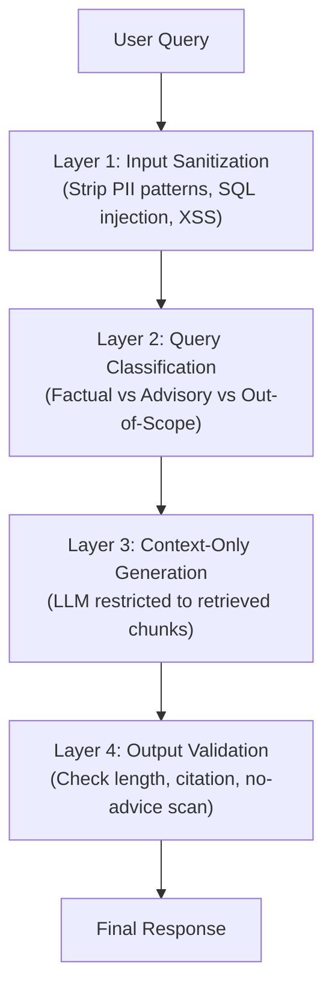
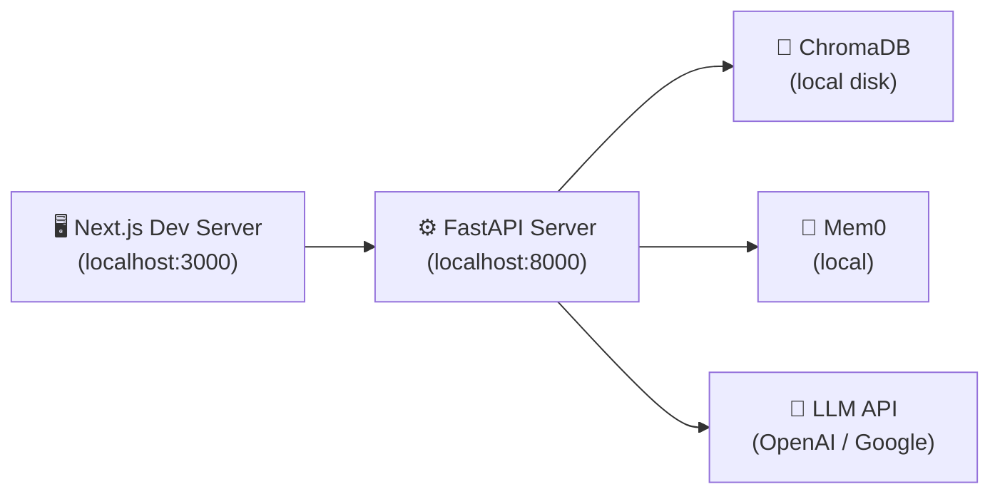
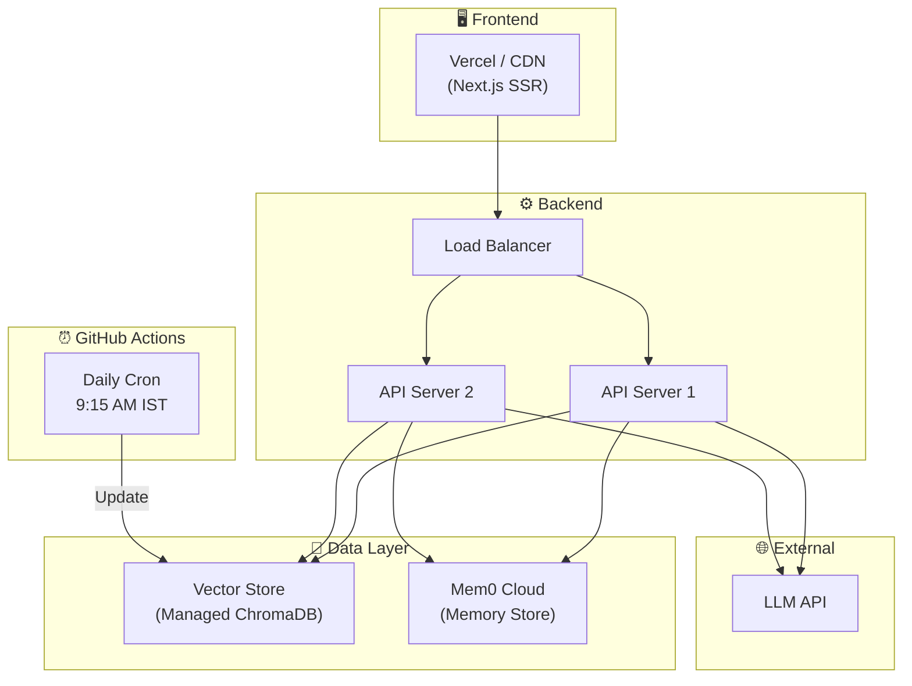

# Mutual Fund FAQ Assistant — Architecture

> **RAG-Powered · Facts-Only · Source-Backed**

---

## Table of Contents

- [1. Architecture Overview](#1-architecture-overview)
- [2. High-Level System Diagram](#2-high-level-system-diagram)
- [3. Component Deep-Dive](#3-component-deep-dive)
  - [3.1 Frontend (UI Layer — Next.js)](#31-frontend-ui-layer--nextjs)
  - [3.2 Backend (API Layer)](#32-backend-api-layer)
  - [3.3 RAG Pipeline](#33-rag-pipeline)
  - [3.4 Vector Store](#34-vector-store)
  - [3.5 LLM Integration](#35-llm-integration)
  - [3.6 Memory Layer (Mem0)](#36-memory-layer-mem0)
- [4. Scheduled Data Refresh (GitHub Actions)](#4-scheduled-data-refresh-github-actions)
- [5. Data Ingestion Pipeline](#5-data-ingestion-pipeline)
- [6. Query Processing Flow](#6-query-processing-flow)
- [7. Prompt Engineering](#7-prompt-engineering)
- [8. Safety & Guardrails](#8-safety--guardrails)
- [9. Technology Stack](#9-technology-stack)
- [10. Project Structure](#10-project-structure)
- [11. Deployment Architecture](#11-deployment-architecture)
- [12. Performance & Scalability](#12-performance--scalability)
- [13. Known Limitations](#13-known-limitations)

---

## 1. Architecture Overview

The system follows a **Retrieval-Augmented Generation (RAG)** architecture with **live data refresh** and **user memory**. Instead of relying solely on a large language model's parametric knowledge, the assistant retrieves relevant chunks from a continuously updated corpus of official mutual fund documents and uses them — along with user-specific memory context from **Mem0** — to generate accurate, personalized, source-backed answers.

A **GitHub Actions scheduler** runs daily at **9:15 AM IST** (pre-market) to fetch the latest data from official sources and update the vector store, ensuring the corpus is never stale.

### Design Principles

| Principle | Description |
|---|---|
| **Facts-Only** | No opinions, advice, or recommendations — ever |
| **Source-Backed** | Every answer includes exactly one citation link |
| **Live Data** | Corpus refreshed daily at 9:15 AM IST via GitHub Actions |
| **Memory-Aware** | Personalized context via Mem0 (user preferences, past queries) |
| **Privacy-First** | Zero collection of PII (PAN, Aadhaar, OTPs, etc.) |
| **Transparency** | Short, verifiable responses with last-updated dates |
| **Modern UI** | Next.js-powered interface with streaming, dark mode, and rich UX |

---

## 2. High-Level System Diagram



---

## 3. Component Deep-Dive

### 3.1 Frontend (UI Layer — Next.js)

A modern, responsive chat interface built with **Next.js (App Router)** adhering strictly to the **Nocturnal Growth** UI/UX specifications.

| Feature | Details |
|---|---|
| **Welcome Screen** | Styled dashboard state greeting the user and presenting high-performance, dark-mode visual elements |
| **Market Ticker** | Horizontal scrolling ticker showing real-time Indian stock market indices (NIFTY 50, SENSEX, etc.) |
| **Quick Access Cards** | Clickable example question cards (e.g., "What is an SIP?", "Start Investing") to guide the user |
| **Active Chat View** | Interactive canvas with user and bot chat bubbles, custom scrollbars, and `animated-mesh-bg` gradient |
| **Typing Indicator** | 3-dot bouncing loading animation for real-time visual feedback |
| **Citation Badge** | Clickable source link below each response opening in a new tab |
| **Response Footer** | `"Last updated from sources: <date>"` displayed on every factual answer |
| **Regulatory Advisory** | Persistent regulatory text at the very bottom: *"Mutual Fund investments are subject to market risks..."* |
| **Chat History Sidebar** | Collapsible sidebar listing previous conversations, with a "New Conversation" and "Clear Chat" button |
| **User Session** | Anonymous UUID generated and stored in `localStorage` for personalized memory integration |

#### Visual Design Tokens (Nocturnal Growth)

- **Color Palette (CSS Variables)**:
  - `--background`, `--surface`, `--surface-dim`: `#101415` (deep slate navy canvas)
  - `--surface-container-low`: `#191c1e`
  - `--surface-container`: `#1d2022`
  - `--surface-container-high`: `#272a2c`
  - `--surface-container-highest`: `#323537`
  - `--primary`: `#4edea3` (vibrant emerald green accent)
  - `--primary-container`: `#10b981`
  - `--secondary`: `#bec6e0`
  - `--tertiary`: `#b9c7e0`
  - `--on-surface`: `#e0e3e5` (preventing glare)
  - `--on-surface-variant`: `#bbcabf`
  - `--outline`: `#86948a`
  - `--outline-variant`: `#3c4a42`
- **Typography (Google Fonts)**:
  - **Hanken Grotesk**: For headlines and body text (sharp, technical geometry).
  - **JetBrains Mono**: For numbers, badges, tags, and small status indicators.
- **Spacing & Layout**:
  - Based on a fluid 8px rhythmic scale.
  - Mobile: 4 columns, 16px gutter, 16px margins.
  - Desktop: 12 columns, 24px gutter, 48px margins. Max width 1280px.
- **Shapes & Border Radii**:
  - Buttons and input fields: `4px` (`0.25rem`) border radius.
  - Containers and cards: `8px` (`0.5rem`) border radius.
  - Chips / suggested follow-ups: Fully pill-shaped (`9999px`).

**Tech Choices:**
- **Next.js 14+** (App Router with React Server Components)
- **TypeScript** for type safety
- **Tailwind CSS** configured with the custom tokens from `ux_ui/stitch_smartinvest_ai_assistant/nocturnal_growth/DESIGN.md`
- Server-side API routes (`/app/api/`) or direct fetch to proxy backend calls
- **Streaming** via `ReadableStream` for real-time LLM output
- Responsive design for desktop & mobile (mobile navigation, hidden desktop sidebar)

#### Next.js Route Structure

```
frontend/
├── app/
│   ├── layout.tsx              # Root layout with theme provider
│   ├── page.tsx                # Main chat page
│   ├── api/
│   │   ├── chat/route.ts       # Proxy to FastAPI /api/chat
│   │   └── sources/route.ts    # Proxy to FastAPI /api/sources
│   └── globals.css             # Global styles
├── components/
│   ├── ChatWindow.tsx          # Main chat container
│   ├── MessageBubble.tsx       # Individual message with citation
│   ├── ExampleQuestions.tsx    # Clickable starter questions
│   ├── DisclaimerBanner.tsx    # Facts-only disclaimer
│   ├── ThemeToggle.tsx         # Dark/light mode switch
│   └── SourceBadge.tsx         # Citation link display
├── lib/
│   ├── api.ts                  # API client functions
│   └── types.ts                # TypeScript interfaces
├── next.config.js
├── package.json
└── tsconfig.json
```

---

### 3.2 Backend (API Layer)

A lightweight REST API server that orchestrates the entire query-to-response pipeline.

| Endpoint | Method | Purpose |
|---|---|---|
| `/api/chat` | `POST` | Accept user query, return RAG response with memory context |
| `/api/health` | `GET` | Health check for monitoring |
| `/api/sources` | `GET` | Return list of curated source URLs |
| `/api/memory/{user_id}` | `GET` | Retrieve user's memory/preferences from Mem0 |
| `/api/memory/{user_id}` | `DELETE` | Clear a user's stored memory |
| `/api/ingest/trigger` | `POST` | Manually trigger data re-ingestion (admin) |

**Tech Choice:** Python with **FastAPI**

- Async request handling for non-blocking I/O
- Built-in request validation via Pydantic models
- Auto-generated OpenAPI docs for development

#### Request / Response Schema

```json
// POST /api/chat — Request
{
  "query": "What is the expense ratio of SBI Bluechip Fund?",
  "user_id": "user_abc123"  // Optional: enables memory-aware responses
}

// POST /api/chat — Response
{
  "answer": "The expense ratio of SBI Bluechip Fund (Direct Plan) is 0.81% as of the latest factsheet.",
  "source_url": "https://www.sbimf.com/en-us/schemes/equity/sbi-bluechip-fund",
  "last_updated": "2026-06-08",
  "is_refusal": false,
  "memory_used": ["User previously asked about SBI Bluechip Fund"]
}

// POST /api/chat — Refusal Response
{
  "answer": "I can only provide factual information about mutual fund schemes. For investment guidance, please visit the AMFI investor education portal.",
  "source_url": "https://www.amfiindia.com/investor-corner/knowledge-center.html",
  "last_updated": null,
  "is_refusal": true,
  "memory_used": []
}
```

---

### 3.3 RAG Pipeline

The core intelligence layer. Follows a **Retrieve → Re-Rank → Generate** pattern.



| Stage | Description | Configuration |
|---|---|---|
| **Query Embedding** | Converts user query into a dense vector | Model: `BAAI/bge-large-en` |
| **Semantic Search** | Finds the most relevant document chunks via cosine similarity | Top-K = 5 |
| **Re-Ranking** *(optional)* | Cross-encoder re-ranks retrieved chunks for higher precision | Model: `cross-encoder/ms-marco-MiniLM-L-6-v2` |
| **LLM Generation** | Generates a facts-only answer from the top chunks + system prompt | Max 3 sentences, 1 citation |

---

### 3.4 Vector Store

Stores embedded document chunks for fast semantic retrieval.

| Option | Type | Best For |
|---|---|---|
| **ChromaDB** | Embedded / Server | Simple setup, persistent storage, metadata filtering |
| **FAISS** | In-memory | Ultra-fast retrieval, lightweight deployments |
| **Qdrant** | Server | Production-grade, advanced filtering |

**Recommended: ChromaDB** — easiest to set up, supports metadata filtering (by scheme, document type, date), and persists to disk.

#### Chunk Metadata Schema

Each stored chunk carries metadata for accurate citation:

```json
{
  "chunk_id": "sbi_bluechip_factsheet_chunk_003",
  "text": "The expense ratio of SBI Bluechip Fund (Direct Plan) is 0.81%...",
  "source_url": "https://www.sbimf.com/...",
  "source_type": "factsheet",
  "scheme_name": "SBI Bluechip Fund",
  "amc": "SBI Mutual Fund",
  "document_date": "2026-05-31",
  "ingestion_date": "2026-06-01"
}
```

---

### 3.5 LLM Integration

The LLM generates the final natural-language response, **constrained** by the system prompt and retrieved context.

| Parameter | Value | Rationale |
|---|---|---|
| **Model** | `gpt-4o-mini` / `gemini-1.5-flash` / open-source alternative | Cost-effective, fast, sufficient for fact extraction |
| **Temperature** | `0.0 – 0.1` | Minimize hallucination; maximize factual consistency |
| **Max Tokens** | `200` | Enforce conciseness (≤ 3 sentences) |
| **Top-P** | `0.9` | Slightly constrained nucleus sampling |

> [!IMPORTANT]
> The LLM is **never** called without retrieved context. If no relevant chunks are found, the system returns a polite "I don't have information on that" response instead of generating from parametric knowledge.

---

### 3.6 Memory Layer (Mem0)

**[Mem0](https://github.com/mem0ai/mem0)** provides a persistent, user-scoped memory layer that enables the assistant to remember past interactions and user preferences across sessions.

#### Why Mem0?

| Capability | Benefit |
|---|---|
| **User-scoped memory** | Remembers which schemes a user has asked about before |
| **Preference tracking** | Learns user's preferred AMC, fund category, or query patterns |
| **Conversation continuity** | Enables follow-up questions without re-stating context |
| **Auto-managed** | Mem0 handles memory extraction, storage, and retrieval automatically |

#### Memory Architecture



#### Mem0 Integration Code

```python
from mem0 import Memory

# Initialize Mem0
memory = Memory()

# --- At query time: Retrieve relevant memories ---
def get_user_context(user_id: str, query: str) -> list[str]:
    """Fetch relevant memories for the current query."""
    memories = memory.search(query=query, user_id=user_id, limit=5)
    return [m["memory"] for m in memories]

# --- After response: Store new memory ---
def store_interaction(user_id: str, query: str, response: str):
    """Store the Q&A interaction as a memory."""
    memory.add(
        messages=[
            {"role": "user", "content": query},
            {"role": "assistant", "content": response}
        ],
        user_id=user_id
    )

# --- Admin: Clear user memory ---
def clear_user_memory(user_id: str):
    """Delete all stored memories for a user."""
    memory.delete_all(user_id=user_id)
```

#### What Gets Stored in Memory

| Memory Type | Example | How It's Used |
|---|---|---|
| **Scheme Interest** | "User frequently asks about SBI Bluechip Fund" | Prioritize SBI Bluechip chunks in retrieval |
| **Category Preference** | "User is interested in ELSS funds" | Add category context to prompts |
| **Past Questions** | "User previously asked about exit load" | Avoid repeating information, enable follow-ups |
| **Clarification Context** | "User is comparing Direct vs Regular plans" | Maintain conversational thread |

> [!WARNING]
> Mem0 stores **behavioral preferences and query patterns only** — never PII. The `user_id` is a pseudonymous session identifier (e.g., UUID), not an email or phone number.

---

## 4. Scheduled Data Refresh (GitHub Actions)

The corpus is **never static**. A GitHub Actions workflow runs **every day at 9:15 AM IST** (3:45 AM UTC) — just before the Indian stock market opens — to fetch the latest official data and re-index it into the vector store.

### Why 9:15 AM IST?

- Indian equity markets open at **9:15 AM IST**
- AMCs typically publish updated NAVs and factsheets by **end of previous trading day**
- Running at market open ensures the assistant has the **freshest overnight data**

### GitHub Actions Workflow

```yaml
# .github/workflows/daily-data-refresh.yml
name: Daily Data Refresh

on:
  schedule:
    # 3:45 AM UTC = 9:15 AM IST
    - cron: '45 3 * * *'
  workflow_dispatch:  # Allow manual trigger

jobs:
  refresh-data:
    runs-on: ubuntu-latest
    timeout-minutes: 30

    steps:
      - name: Checkout repository
        uses: actions/checkout@v4

      - name: Set up Python
        uses: actions/setup-python@v5
        with:
          python-version: '3.11'

      - name: Install dependencies
        run: pip install -r requirements.txt

      - name: Run data ingestion pipeline
        env:
          OPENAI_API_KEY: ${{ secrets.OPENAI_API_KEY }}
          CHROMA_PERSIST_DIR: ./vectorstore
          MEM0_API_KEY: ${{ secrets.MEM0_API_KEY }}
        run: python -m src.ingestion.run_pipeline

      - name: Validate ingestion
        run: python -m src.ingestion.validate

      - name: Upload vectorstore artifact
        uses: actions/upload-artifact@v4
        with:
          name: vectorstore-${{ github.run_number }}
          path: ./vectorstore/
          retention-days: 7

      - name: Deploy updated vectorstore
        run: python -m src.ingestion.deploy_vectorstore
        env:
          DEPLOY_TARGET: ${{ secrets.DEPLOY_TARGET }}
```

### Scheduler Flow

```mermaid
flowchart LR
    CRON["⏰ GitHub Actions\nCron: 9:15 AM IST"] --> CHECKOUT["📦 Checkout Repo"]
    CHECKOUT --> FETCH["🌐 Fetch Latest Data\n(AMC, AMFI, SEBI)"]
    FETCH --> DIFF["🔍 Diff Detection\n(New/Changed docs only)"]
    DIFF --> INGEST["📥 Ingestion Pipeline\n(Parse → Chunk → Embed)"]
    INGEST --> VALIDATE["✅ Validate\n(Chunk count, quality)"]
    VALIDATE --> DEPLOY["🚀 Deploy\nUpdated Vectorstore"]
    DEPLOY --> NOTIFY["📧 Notify on\nSuccess/Failure"]
```



### Incremental vs Full Refresh

| Strategy | When | Details |
|---|---|---|
| **Incremental** | Daily (default) | Only process new/changed documents (via hash comparison) |
| **Full Refresh** | Weekly (Sunday) | Re-process entire corpus to catch any drift |
| **Manual Trigger** | On-demand | `workflow_dispatch` for emergency updates |

### Diff Detection Logic

```python
import hashlib
import json

def detect_changes(sources_file: str, cache_file: str) -> list[dict]:
    """Compare current source hashes with cached hashes to find changes."""
    with open(sources_file) as f:
        sources = json.load(f)
    
    try:
        with open(cache_file) as f:
            cached_hashes = json.load(f)
    except FileNotFoundError:
        cached_hashes = {}
    
    changed_sources = []
    for source in sources:
        content = fetch_content(source["url"])
        current_hash = hashlib.sha256(content.encode()).hexdigest()
        
        if source["url"] not in cached_hashes or cached_hashes[source["url"]] != current_hash:
            changed_sources.append(source)
            cached_hashes[source["url"]] = current_hash
    
    with open(cache_file, "w") as f:
        json.dump(cached_hashes, f)
    
    return changed_sources
```

---

## 5. Data Ingestion Pipeline

The ingestion pipeline — triggered daily by the GitHub Actions scheduler — processes official documents into the vector store.



### Chunking Strategy

| Parameter | Value | Rationale |
|---|---|---|
| **Method** | Recursive Character Text Splitter | Preserves semantic boundaries (paragraphs, sections) |
| **Chunk Size** | 500–800 characters | Balances context richness with retrieval precision |
| **Chunk Overlap** | 100–150 characters | Ensures no information is lost at chunk boundaries |
| **Separators** | `["\n\n", "\n", ". ", " "]` | Splits at natural language boundaries |

### Source URL Catalog

A JSON manifest maps every chunk back to its source:

```json
[
  {
    "url": "https://www.sbimf.com/en-us/schemes/equity/sbi-bluechip-fund",
    "type": "factsheet",
    "scheme": "SBI Bluechip Fund",
    "last_scraped": "2026-06-01"
  },
  {
    "url": "https://www.amfiindia.com/mutual-fund-scheme-info",
    "type": "amfi_guidance",
    "scheme": null,
    "last_scraped": "2026-06-01"
  }
]
```

---

## 6. Query Processing Flow

End-to-end flow from user input to displayed response, including **memory retrieval and storage**:



---

## 7. Prompt Engineering

### System Prompt

```text
You are a facts-only mutual fund FAQ assistant. You answer objective, verifiable
questions about mutual fund schemes using ONLY the provided context.

You have access to the user's past interaction memory (if available). Use it to:
- Understand which schemes or categories the user has shown interest in
- Provide continuity in follow-up conversations
- Avoid repeating information the user already received
Do NOT reference the memory system to the user. Use it naturally.

STRICT RULES:
1. Answer in a MAXIMUM of 3 sentences.
2. Use ONLY information present in the provided context. Do NOT use your own knowledge.
3. If the context does not contain the answer, state that you do not have the information in your current sources, and dynamically retrieve a relevant URL from `data/sources.json` based on keywords in the query to suggest to the user (e.g. if they ask about KYC or tax statements and no context is retrieved, direct them to the HDFC KYC or Taxation links).
4. NEVER provide investment advice, opinions, or recommendations.
5. NEVER compare fund performance or calculate returns.
6. NEVER ask for or acknowledge personal information (PAN, Aadhaar, account numbers,
   OTPs, email, or phone numbers).
7. For performance-related questions, direct the user to the official factsheet link.
8. Always be polite, professional, and concise.
```

### Query Template

```text
Context:
{retrieved_chunks}

Source URL: {source_url}
Document Date: {document_date}

User Memory (past interactions):
{user_memories}

User Question: {user_query}

Provide a factual answer in 3 sentences or fewer. Cite the source URL.
Leverage user memory for conversational continuity if relevant.
```

### Refusal Prompt

```text
The user asked: "{user_query}"

This query requests investment advice, a subjective opinion, or a fund comparison.
Respond politely, explain that you only provide factual information, and suggest
visiting the AMFI investor education portal: https://www.amfiindia.com/investor-corner/knowledge-center.html
```

---

## 8. Safety & Guardrails

### Multi-Layer Protection



### Query Classification Rules

| Category | Detection Method | Action |
|---|---|---|
| **Factual** | Keywords: expense ratio, exit load, SIP, NAV, benchmark, etc. | ✅ Proceed to RAG |
| **Advisory** | Patterns: "should I", "which is better", "recommend", "invest in" | ❌ Polite refusal + AMFI link |
| **Performance Comparison** | Patterns: "compare returns", "better performance", "will give" | ❌ Refusal + factsheet link |
| **PII Detected** | Regex: PAN (`[A-Z]{5}[0-9]{4}[A-Z]`), Aadhaar (`\d{12}`), email, phone | ❌ Refuse + privacy warning |
| **Out-of-Scope** | No relevant chunks retrieved (similarity < threshold) | ❌ "I don't have this information" |

### PII Detection Patterns

```python
PII_PATTERNS = {
    "pan": r"[A-Z]{5}[0-9]{4}[A-Z]{1}",
    "aadhaar": r"\b\d{4}\s?\d{4}\s?\d{4}\b",
    "phone": r"\b[6-9]\d{9}\b",
    "email": r"[a-zA-Z0-9._%+-]+@[a-zA-Z0-9.-]+\.[a-zA-Z]{2,}",
    "otp": r"\b\d{4,6}\b",  # Combined with context-aware check
    "account": r"\b\d{9,18}\b"  # Bank account number pattern
}
```

### Output Validation Checklist

| Check | Rule | On Failure |
|---|---|---|
| **Length** | ≤ 3 sentences | Truncate or re-generate |
| **Citation** | Exactly 1 valid URL present | Append source URL from metadata |
| **No-Advice Scan** | Scan for advisory language ("recommend", "should invest") | Replace with refusal |
| **Footer** | `"Last updated from sources: <date>"` present | Append automatically |

---

## 9. Technology Stack

| Layer | Technology | Purpose |
|---|---|---|
| **Frontend** | **Next.js 14+ (App Router)** + TypeScript | Modern chat UI with SSR and streaming |
| **Backend** | Python + FastAPI | API server, request routing |
| **Memory** | **Mem0** | Persistent user memory across sessions |
| **RAG Framework** | LangChain / LlamaIndex | Orchestrate retrieve-then-generate |
| **Embedding Model** | `BAAI/bge-large-en` (HuggingFace) | Convert text to vectors — 1024-dim, top-tier retrieval accuracy |
| **Vector Store** | ChromaDB | Store and retrieve document embeddings |
| **LLM** | OpenAI `gpt-4o-mini` / Google `gemini-1.5-flash` | Generate facts-only responses |
| **PDF Parsing** | `pdfplumber` / `PyPDF2` | Extract text from factsheets, SID, KIM |
| **HTML Scraping** | `BeautifulSoup` / `trafilatura` | Extract content from web pages |
| **Text Splitting** | LangChain `RecursiveCharacterTextSplitter` | Chunk documents for indexing |
| **Scheduler** | **GitHub Actions** (cron) | Daily data refresh at 9:15 AM IST |
| **Environment** | `python-dotenv` | Manage API keys and config |

---

## 10. Project Structure

```
MutualFundChatBot/
├── .github/
│   └── workflows/
│       └── daily-data-refresh.yml   # GitHub Actions: 9:15 AM IST daily cron
│
├── docs/
│   ├── problemStatement.md          # Problem statement
│   ├── problemStatement.txt         # Original problem statement
│   └── architecture.md              # This document
│
├── data/
│   ├── raw/                         # Raw downloaded PDFs and HTML files
│   ├── processed/                   # Cleaned and chunked text files
│   ├── sources.json                 # URL catalog with metadata
│   └── hashes.json                  # Content hashes for diff detection
│
├── src/
│   ├── ingestion/
│   │   ├── __init__.py
│   │   ├── scraper.py               # Web scraper for HTML pages
│   │   ├── pdf_parser.py            # PDF text extraction
│   │   ├── chunker.py               # Text splitting and chunking
│   │   ├── indexer.py               # Embedding generation + vector store indexing
│   │   ├── diff_detector.py         # Hash-based change detection
│   │   ├── run_pipeline.py          # Main ingestion entry point (called by GH Actions)
│   │   ├── validate.py              # Post-ingestion validation checks
│   │   └── deploy_vectorstore.py    # Deploy updated vectorstore to production
│   │
│   ├── core/
│   │   ├── __init__.py
│   │   ├── query_classifier.py      # Classify queries (factual / advisory / PII)
│   │   ├── rag_pipeline.py          # End-to-end RAG orchestration
│   │   ├── prompt_templates.py      # System prompt, query template, refusal prompt
│   │   └── response_formatter.py    # Enforce 3-sentence limit, citation, footer
│   │
│   ├── memory/
│   │   ├── __init__.py
│   │   ├── mem0_client.py           # Mem0 initialization and configuration
│   │   ├── memory_manager.py        # Retrieve, store, and clear user memories
│   │   └── memory_formatter.py      # Format memories for prompt injection
│   │
│   ├── guardrails/
│   │   ├── __init__.py
│   │   ├── pii_detector.py          # PII pattern matching
│   │   ├── input_sanitizer.py       # Input cleaning and validation
│   │   └── output_validator.py      # Output compliance checks
│   │
│   ├── api/
│   │   ├── __init__.py
│   │   ├── main.py                  # FastAPI app entry point
│   │   ├── routes.py                # API route definitions
│   │   └── schemas.py               # Pydantic request/response models
│   │
│   └── utils/
│       ├── __init__.py
│       └── logger.py                # Structured logging
│
├── frontend/                        # Next.js application
│   ├── app/
│   │   ├── layout.tsx               # Root layout with metadata and theme
│   │   ├── page.tsx                 # Main chat page
│   │   ├── globals.css              # Global styles
│   │   └── api/
│   │       ├── chat/route.ts        # API route: proxy to FastAPI /api/chat
│   │       └── sources/route.ts     # API route: proxy to FastAPI /api/sources
│   │
│   ├── components/
│   │   ├── ChatWindow.tsx           # Main chat container
│   │   ├── MessageBubble.tsx        # Individual message with citation
│   │   ├── ExampleQuestions.tsx     # Clickable starter questions
│   │   ├── DisclaimerBanner.tsx     # Facts-only disclaimer
│   │   ├── ThemeToggle.tsx          # Dark/light mode switch
│   │   └── SourceBadge.tsx          # Citation link display
│   │
│   ├── lib/
│   │   ├── api.ts                   # API client functions
│   │   └── types.ts                 # TypeScript interfaces
│   │
│   ├── public/                      # Static assets
│   ├── next.config.js
│   ├── package.json
│   └── tsconfig.json
│
├── vectorstore/                     # ChromaDB persistent storage
│
├── tests/
│   ├── test_query_classifier.py     # Unit tests for classification
│   ├── test_rag_pipeline.py         # Integration tests for RAG
│   ├── test_guardrails.py           # Tests for PII detection and refusal
│   ├── test_memory.py               # Tests for Mem0 memory operations
│   ├── test_ingestion.py            # Tests for data ingestion pipeline
│   └── test_api.py                  # API endpoint tests
│
├── .env                             # API keys (not committed to git)
├── .gitignore
├── requirements.txt                 # Python dependencies
├── context.md                       # Project context document
└── README.md                        # Setup, usage, and architecture overview
```

---

## 11. Deployment Architecture

### Local Development



### Production (Recommended)



### Environment Variables

```bash
# .env

# --- LLM ---
OPENAI_API_KEY=sk-...                  # or GOOGLE_API_KEY for Gemini
LLM_MODEL=gpt-4o-mini
TEMPERATURE=0.0
MAX_TOKENS=200

# --- Embeddings ---
EMBEDDING_MODEL=BAAI/bge-large-en

# --- Vector Store ---
CHROMA_PERSIST_DIR=./vectorstore
CHUNK_SIZE=600
CHUNK_OVERLAP=100
TOP_K_RETRIEVAL=5

# --- Mem0 (Memory) ---
MEM0_API_KEY=m0-...                    # Mem0 Cloud API key (or leave blank for local)
MEM0_ORG_ID=org_...
MEM0_PROJECT_ID=proj_...

# --- Next.js Frontend ---
NEXT_PUBLIC_API_URL=http://localhost:8000  # Backend API base URL

# --- GitHub Actions (set as repository secrets) ---
# OPENAI_API_KEY, MEM0_API_KEY, DEPLOY_TARGET
```

---

## 12. Performance & Scalability

| Metric | Target | Strategy |
|---|---|---|
| **Response Latency** | < 3 seconds (end-to-end) | Use fast embedding model, keep corpus small, use in-memory FAISS for speed |
| **Retrieval Accuracy** | > 90% relevance in top-3 chunks | Fine-tune chunk size, use re-ranker, maintain clean corpus |
| **Throughput** | ~50 concurrent users | Async FastAPI with uvicorn workers |
| **Corpus Freshness** | **Daily refresh (9:15 AM IST)** | GitHub Actions cron + incremental ingestion |
| **Memory Latency** | < 200ms per memory lookup | Mem0 optimized search with `limit=5` |
| **Uptime** | 99.5%+ | Health checks, auto-restart, managed deployment |

### Caching Strategy

- **Query cache**: Cache frequent query → response pairs (LRU, TTL = 24h)
- **Embedding cache**: Cache query embeddings for repeated queries
- **Chunk deduplication**: Remove near-duplicate chunks during ingestion
- **Memory cache**: Hot-cache recent memory lookups per user session

---

## 13. Known Limitations

| Limitation | Impact | Mitigation |
|---|---|---|
| **Single AMC** | Limited coverage across the mutual fund market | Design for easy AMC expansion |
| **PDF parsing quality** | Complex layouts (tables, charts) may lose data | Use `pdfplumber` for table extraction; manual review |
| **Intraday data gap** | Data refreshes at 9:15 AM; intraday changes not captured | Display "Last updated" timestamp; direct to live sources |
| **GitHub Actions limits** | Free tier has limited minutes; cron may be delayed | Use `workflow_dispatch` as backup; monitor run times |
| **LLM hallucination** | Model may generate plausible but incorrect facts | Temperature = 0, context-only generation, output validation |
| **Memory accumulation** | Long-term users may accumulate noisy memories | Mem0 auto-manages relevance; provide "Clear Memory" button |
| **Memory cold start** | New users have no memory context | Graceful fallback — system works identically without memory |
| **Language** | English-only support | Future: Add Hindi and regional language support |

---

> [!NOTE]
> This architecture is designed to be **incrementally buildable**. Start with the data ingestion pipeline, validate retrieval quality, then layer on the API, memory, and UI. Each component can be developed and tested independently.
