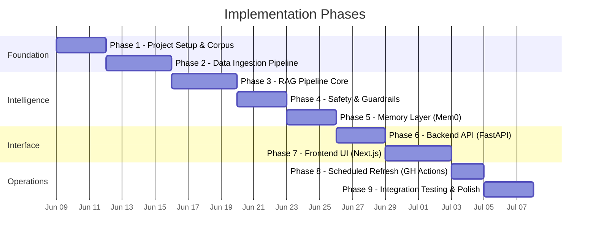

# Mutual Fund FAQ Assistant — Implementation Plan

> **Phase-wise execution plan · Each phase validated via [evals.md](file:///c:/Users/varad/Desktop/Gen%20AI/MutualFundChatBot/docs/evals.md)**

---

## Phases Overview



| Phase | Name | Est. Duration | Dependencies |
|---|---|---|---|
| 1 | Project Setup & Corpus Definition | 3 days | None |
| 2 | Data Ingestion Pipeline | 4 days | Phase 1 |
| 3 | RAG Pipeline Core | 4 days | Phase 2 |
| 4 | Safety & Guardrails | 3 days | Phase 3 |
| 5 | Memory Layer (Mem0) | 3 days | Phase 3 |
| 6 | Backend API (FastAPI) | 3 days | Phase 3, 4, 5 |
| 7 | Frontend UI (Next.js) | 4 days | Phase 6 |
| 8 | Scheduled Data Refresh | 2 days | Phase 2, 6 |
| 9 | Integration Testing & Polish | 3 days | All phases |

> [!IMPORTANT]
> **Before advancing to the next phase**, run the evaluations defined in [evals.md](file:///c:/Users/varad/Desktop/Gen%20AI/MutualFundChatBot/docs/evals.md) for the current phase. All eval criteria must pass.

---

## Phase 1: Project Setup & Corpus Definition

### Objective
Set up the project structure, select AMC and schemes, and curate the official source corpus.

### Tasks

#### 1.1 Project Scaffolding
- [x] Create the full directory structure as defined in [architecture.md §10](file:///c:/Users/varad/Desktop/Gen%20AI/MutualFundChatBot/docs/architecture.md)
- [x] Initialize Python environment with `requirements.txt`
- [x] Initialize Next.js frontend with `npx create-next-app`
- [x] Create `.env` file with placeholder values
- [x] Create `.gitignore` (include `vectorstore/`, `.env`, `node_modules/`, `data/raw/`)

#### 1.2 AMC & Scheme Selection
- [x] Select **one AMC** (e.g., SBI Mutual Fund, HDFC AMC, ICICI Prudential)
- [x] Choose **3–5 schemes** with category diversity:
  - Large-Cap fund
  - Flexi-Cap fund
  - ELSS (Tax-Saving) fund
  - Debt / Hybrid fund (optional diversity)
- [x] Document the selected AMC and schemes in `data/sources.json`

#### 1.3 Corpus Collection (15–25 URLs)
- [x] Identify and collect URLs for each source type:

| Source Type | Target Count | Example |
|---|---|---|
| Scheme Factsheets | 3–5 | One per selected scheme |
| KIM (Key Information Memorandum) | 1–2 | AMC-level document |
| SID (Scheme Information Document) | 1–2 | AMC-level document |
| AMC FAQ / Help Pages | 3–5 | Statement downloads, tax guides |
| AMFI Guidance Pages | 2–3 | Investor education, NAV lookup |
| SEBI Pages | 1–2 | Regulatory guidelines |

- [x] Create `data/sources.json` manifest:
```json
[
  {
    "url": "https://...",
    "type": "factsheet",
    "scheme": "Scheme Name",
    "category": "large_cap",
    "format": "pdf",
    "last_scraped": null
  }
]
```
- [x] Download raw PDFs/HTML pages to `data/raw/`
- [x] Verify all URLs are accessible and from official sources only

### Deliverables
- Complete project directory structure
- `data/sources.json` with 15–25 verified official URLs
- Raw downloaded documents in `data/raw/`
- Working Python and Next.js environments

### ✅ Run Evals: [Phase 1 Evaluations](file:///c:/Users/varad/Desktop/Gen%20AI/MutualFundChatBot/docs/evals.md#phase-1-project-setup--corpus-definition)

---

## Phase 2: Data Ingestion Pipeline

### Objective
Build the pipeline that processes raw documents into embedded, indexed chunks in the vector store.

### Tasks

#### 2.1 PDF Parser (`src/ingestion/pdf_parser.py`)
- [ ] Implement PDF text extraction using `pdfplumber`
- [ ] Handle multi-page documents
- [ ] Extract tables (expense ratios, fund details) as structured text
- [ ] Remove headers, footers, page numbers, and watermarks
- [ ] Preserve section headers for metadata tagging

#### 2.2 HTML Scraper (`src/ingestion/scraper.py`)
- [ ] Implement web scraping using `BeautifulSoup` / `trafilatura`
- [ ] Handle AMC website pages, AMFI pages, SEBI pages
- [ ] Extract main content, strip navigation/ads/footers
- [ ] Save scraped content with source URL metadata

#### 2.3 Text Chunker (`src/ingestion/chunker.py`)
- [ ] Implement `RecursiveCharacterTextSplitter` with configuration:
  - Chunk size: 500–800 characters
  - Chunk overlap: 100–150 characters
  - Separators: `["\n\n", "\n", ". ", " "]`
- [ ] Preserve semantic boundaries (don't split mid-sentence if possible)
- [ ] Attach metadata to each chunk:
  - `chunk_id`, `source_url`, `source_type`, `scheme_name`, `amc`, `document_date`, `ingestion_date`

#### 2.4 Embedding & Indexing (`src/ingestion/indexer.py`)
- [ ] Load `BAAI/bge-large-en` embedding model from HuggingFace
- [ ] Generate 1024-dim embeddings for each chunk
- [ ] Initialize ChromaDB collection with persistent storage
- [ ] Index all chunks with embeddings + metadata into ChromaDB
- [ ] Implement deduplication logic (skip near-identical chunks)

#### 2.5 Diff Detector (`src/ingestion/diff_detector.py`)
- [ ] Implement SHA-256 hash-based change detection
- [ ] Compare current content hashes against `data/hashes.json`
- [ ] Return list of changed/new sources for incremental ingestion
- [ ] Update hash cache after successful ingestion

#### 2.6 Pipeline Runner (`src/ingestion/run_pipeline.py`)
- [ ] Orchestrate: Fetch → Parse → Chunk → Embed → Index
- [ ] Support both incremental and full-refresh modes
- [ ] Add logging (structured, with timestamps)
- [ ] Handle errors gracefully (skip failed sources, log warnings)

#### 2.7 Validation (`src/ingestion/validate.py`)
- [ ] Verify minimum chunk count in vector store
- [ ] Check that all source URLs have at least one chunk
- [ ] Validate metadata completeness (no null `source_url` or `scheme_name`)
- [ ] Log summary stats: total chunks, chunks per source, avg chunk size

### Deliverables
- Fully functional ingestion pipeline
- ChromaDB populated with embedded chunks from all sources
- `data/hashes.json` with content hashes
- Validation script with passing output

### ✅ Run Evals: [Phase 2 Evaluations](file:///c:/Users/varad/Desktop/Gen%20AI/MutualFundChatBot/docs/evals.md#phase-2-data-ingestion-pipeline)

---

## Phase 3: RAG Pipeline Core

### Objective
Build the core Retrieve → Re-Rank → Generate pipeline that answers factual queries.

### Tasks

#### 3.1 Query Embedding
- [ ] Reuse `BAAI/bge-large-en` model from ingestion phase
- [ ] Implement query → embedding conversion function
- [ ] Add `Represent this sentence for searching relevant passages:` prefix (BGE-specific instruction)

#### 3.2 Retriever (`src/core/rag_pipeline.py`)
- [ ] Implement ChromaDB semantic search with cosine similarity
- [ ] Retrieve Top-K = 5 chunks per query
- [ ] Filter by metadata if applicable (e.g., specific scheme)
- [ ] Return chunks with full metadata (source_url, document_date, etc.)

#### 3.3 Re-Ranker (optional)
- [ ] Integrate `cross-encoder/ms-marco-MiniLM-L-6-v2` for re-ranking
- [ ] Re-rank Top-5 → Top-3 chunks
- [ ] Make re-ranker configurable (can be toggled off)

#### 3.4 LLM Generator
- [ ] Integrate OpenAI `gpt-4o-mini` or Google `gemini-1.5-flash`
- [ ] Configure: temperature=0.0, max_tokens=200, top_p=0.9
- [ ] Pass system prompt + retrieved context + query to LLM
- [ ] Implement fallback: if no relevant chunks found, perform keyword matching against the HDFC scheme names and resource note categories in `data/sources.json` to retrieve the most relevant official URL, and return: "I don't have this information in my current sources. You may find more details at: <URL>"

#### 3.5 Prompt Templates (`src/core/prompt_templates.py`)
- [ ] Implement system prompt (facts-only, 3-sentence limit, no advice)
- [ ] Implement query template with context, source_url, document_date slots
- [ ] Implement refusal prompt for advisory queries
- [ ] Templates should accept memory context slot (used in Phase 5)

#### 3.6 Response Formatter (`src/core/response_formatter.py`)
- [ ] Enforce ≤ 3 sentence limit
- [ ] Attach exactly one citation link from metadata
- [ ] Append `"Last updated from sources: <date>"` footer
- [ ] Validate output format before returning

### Deliverables
- Working RAG pipeline: query → embedding → retrieval → generation → formatted response
- Testable via Python script (no API needed yet)
- Correct citation and footer on every response

### ✅ Run Evals: [Phase 3 Evaluations](file:///c:/Users/varad/Desktop/Gen%20AI/MutualFundChatBot/docs/evals.md#phase-3-rag-pipeline-core)

---

## Phase 4: Safety & Guardrails

### Objective
Implement multi-layer protection: input sanitization, query classification, PII detection, and output validation.

### Tasks

#### 4.1 Input Sanitizer (`src/guardrails/input_sanitizer.py`)
- [ ] Strip XSS patterns, script tags, and SQL injection attempts
- [ ] Normalize whitespace and Unicode
- [ ] Truncate excessively long inputs (max 500 characters)
- [ ] Return sanitized query string

#### 4.2 Query Classifier (`src/core/query_classifier.py`)
- [ ] Classify queries into categories:

| Category | Detection Patterns |
|---|---|
| Factual | expense ratio, exit load, SIP, NAV, benchmark, lock-in, riskometer |
| Advisory | "should I", "which is better", "recommend", "invest in", "good fund" |
| Performance Comparison | "compare returns", "better performance", "will give", "returns" |
| Out-of-Scope | No matching patterns or low confidence |

- [ ] Return classification with confidence score
- [ ] Support both keyword-based and LLM-based classification

#### 4.3 PII Detector (`src/guardrails/pii_detector.py`)
- [ ] Implement regex patterns for:
  - PAN: `[A-Z]{5}[0-9]{4}[A-Z]{1}`
  - Aadhaar: `\b\d{4}\s?\d{4}\s?\d{4}\b`
  - Phone: `\b[6-9]\d{9}\b`
  - Email: `[a-zA-Z0-9._%+-]+@[a-zA-Z0-9.-]+\.[a-zA-Z]{2,}`
  - OTP: `\b\d{4,6}\b` (with context-aware check)
  - Bank Account: `\b\d{9,18}\b`
- [ ] Return detected PII types (without storing the actual values)
- [ ] Generate appropriate privacy warning response

#### 4.4 Output Validator (`src/guardrails/output_validator.py`)
- [ ] Validate response length (≤ 3 sentences)
- [ ] Check for exactly 1 citation URL
- [ ] Scan for advisory language ("recommend", "should invest", "good fund")
- [ ] Verify footer presence (`"Last updated from sources: <date>"`)
- [ ] On validation failure: auto-fix or re-generate

#### 4.5 Integration with RAG Pipeline
- [ ] Wire all guardrails into the RAG pipeline flow:
  1. Input Sanitization → 2. PII Detection → 3. Query Classification → 4. RAG → 5. Output Validation
- [ ] Ensure refusal responses include educational link (AMFI/SEBI)

### Deliverables
- All guardrail modules with unit tests
- RAG pipeline with integrated safety layers
- Correctly refuses advisory queries with polite response + AMFI link
- Blocks and warns on PII detection

### ✅ Run Evals: [Phase 4 Evaluations](file:///c:/Users/varad/Desktop/Gen%20AI/MutualFundChatBot/docs/evals.md#phase-4-safety--guardrails)

---

## Phase 5: Memory Layer (Mem0)

### Objective
Integrate Mem0 for persistent, user-scoped conversational memory.

### Tasks

#### 5.1 Mem0 Client (`src/memory/mem0_client.py`)
- [ ] Initialize Mem0 `Memory()` instance
- [ ] Configure for local development (in-memory/local storage)
- [ ] Configure for production (Mem0 Cloud with API key)
- [ ] Handle connection errors gracefully

#### 5.2 Memory Manager (`src/memory/memory_manager.py`)
- [ ] Implement `get_user_context(user_id, query)` → retrieve relevant memories
- [ ] Implement `store_interaction(user_id, query, response)` → save Q&A as memory
- [ ] Implement `clear_user_memory(user_id)` → delete all user memories
- [ ] Limit memory retrieval to `limit=5` for performance
- [ ] Graceful degradation: if Mem0 is unavailable, pipeline works without memory

#### 5.3 Memory Formatter (`src/memory/memory_formatter.py`)
- [ ] Format retrieved memories into prompt-injectable text
- [ ] Filter out irrelevant or stale memories
- [ ] Handle empty memory state (new user)

#### 5.4 Integration with RAG Pipeline
- [ ] Add memory retrieval step before LLM generation
- [ ] Inject `{user_memories}` into query template
- [ ] Add memory storage step after successful response
- [ ] Pass `user_id` through the pipeline

#### 5.5 Privacy Safeguards
- [ ] Ensure `user_id` is a pseudonymous UUID, never PII
- [ ] Verify Mem0 only stores behavioral preferences, not PII
- [ ] Implement memory expiry/cleanup policy

### Deliverables
- Working Mem0 integration with memory search, store, and clear
- RAG pipeline enhanced with memory context
- Graceful fallback when memory is unavailable
- Privacy-compliant memory storage

### ✅ Run Evals: [Phase 5 Evaluations](file:///c:/Users/varad/Desktop/Gen%20AI/MutualFundChatBot/docs/evals.md#phase-5-memory-layer-mem0)

---

## Phase 6: Backend API (FastAPI)

### Objective
Expose the RAG pipeline, memory, and ingestion as a REST API.

### Tasks

#### 6.1 Pydantic Schemas (`src/api/schemas.py`)
- [ ] `ChatRequest`: `query` (str, required), `user_id` (str, optional)
- [ ] `ChatResponse`: `answer`, `source_url`, `last_updated`, `is_refusal`, `memory_used`
- [ ] `MemoryResponse`: list of user memories
- [ ] `SourcesResponse`: list of curated sources
- [ ] `IngestTriggerResponse`: ingestion status

#### 6.2 API Routes (`src/api/routes.py`)
- [ ] `POST /api/chat` — Full RAG pipeline with memory
- [ ] `GET /api/health` — Health check (vector store connectivity, LLM availability)
- [ ] `GET /api/sources` — Return curated source list from `data/sources.json`
- [ ] `GET /api/memory/{user_id}` — Retrieve user's stored memories
- [ ] `DELETE /api/memory/{user_id}` — Clear user's memory
- [ ] `POST /api/ingest/trigger` — Manually trigger re-ingestion (admin)

#### 6.3 FastAPI App (`src/api/main.py`)
- [ ] Initialize FastAPI app with metadata (title, description, version)
- [ ] Mount all routes
- [ ] Add CORS middleware (allow Next.js frontend origin)
- [ ] Add request logging middleware
- [ ] Configure uvicorn for local development

#### 6.4 Error Handling
- [ ] Global exception handler for unhandled errors
- [ ] Structured error responses (HTTP status codes, error messages)
- [ ] Rate limiting (optional, for production)

#### 6.5 Streaming Support
- [ ] Implement `StreamingResponse` for `/api/chat`
- [ ] Stream LLM tokens as they are generated
- [ ] Send citation and footer as final chunk

### Deliverables
- Fully functional FastAPI server
- All endpoints tested via OpenAPI docs (`/docs`)
- Streaming chat endpoint
- CORS configured for Next.js frontend

### ✅ Run Evals: [Phase 6 Evaluations](file:///c:/Users/varad/Desktop/Gen%20AI/MutualFundChatBot/docs/evals.md#phase-6-backend-api-fastapi)

---

## Phase 7: Frontend UI (Next.js - Nocturnal Growth Theme)

### Objective
Build a modern, responsive chat interface with Next.js based on the **Nocturnal Growth** design system (vibrant green growth accents on deep navy surfaces).

### Tasks

#### 7.1 Project Setup & Design System Configuration
- [ ] Initialize Next.js 14+ with App Router and TypeScript in the `frontend/` directory
- [ ] Install dependencies (`lucide-react`, `clsx`, `tailwind-merge` if using utility-first styling)
- [ ] Configure `next.config.js` with API proxy to FastAPI backend
- [ ] Add Google Fonts in `app/layout.tsx`: **Hanken Grotesk** (for headings and body) and **JetBrains Mono** (for labels, metrics, and code)
- [ ] Configure `tailwind.config.js` (or `globals.css` variable system) with the custom Nocturnal Growth tokens:
  - Colors: background (`#101415`), surface (`#101415`), primary (`#4edea3`), secondary (`#bec6e0`), tertiary (`#b9c7e0`), surface-container-low (`#191c1e`), surface-container-high (`#272a2c`), surface-container-highest (`#323537`), outline (`#86948a`), outline-variant (`#3c4a42`)
  - Border Radii: `DEFAULT: 0.125rem`, `lg: 0.25rem`, `xl: 0.5rem`, `full: 0.75rem` (soft shapes: 4px for buttons/inputs, 8px for containers/cards, fully pill-shaped for status chips)
  - Typography settings for Hanken Grotesk and JetBrains Mono fonts and sizing
- [ ] Implement custom CSS animations in `app/globals.css`:
  - `typing-dot`: 3 bouncing dots animation for bot loading states
  - `animated-mesh-bg`: gradient shifting across slate-navy levels (`#101415`, `#191c1e`, `#1d2022`, `#0b0f10`)
  - `ticker-scroll` / `marquee`: continuous horizontal scroll animation for index ticker
  - `custom-scrollbar`: clean vertical scroll indicators matching the dark theme

#### 7.2 Layout & Navigation (`app/layout.tsx` & `components/Sidebar.tsx`)
- [ ] Main wrapper layout containing:
  - Collapsible **Left Sidebar** for desktop (`md:flex`) and full slide-over menu for mobile
  - Sidebar logo header ("SmartInvest AI") and "New Conversation" button
  - Sidebar list of past conversation history items grouped by date (Today, Previous 7 Days)
  - Sidebar bottom "Settings" item
  - Main panel representing the header, ticker, and main chat canvas
- [ ] User Session Management: Generate anonymous UUID on first visit, store in `localStorage`, and use for API requests

#### 7.3 Core UI Components

| Component | File | Description |
|---|---|---|
| `Sidebar` | `components/Sidebar.tsx` | Collapsible navigation sidebar for conversation history and actions |
| `Header` | `components/Header.tsx` | App header with active chat state, online status indicator, and "Clear Chat" button |
| `MarketTicker` | `components/MarketTicker.tsx` | Horizontal scrolling index tracker (NIFTY 50, SENSEX, etc.) with green/red trend arrows |
| `ChatWindow` | `components/ChatWindow.tsx` | Message list container with `animated-mesh-bg` shifting gradient background and auto-scroll |
| `MessageBubble` | `components/MessageBubble.tsx` | Message card with Hanken Grotesk text, markdown renderer, citation badges, and suggested follow-ups |
| `DisclaimerBanner` | `components/DisclaimerBanner.tsx` | Persistent regulatory advisory footer in JetBrains Mono (`label-md` typography) |
| `StarterCards` | `components/StarterCards.tsx` | Quick Access grid cards for the initial/empty chat dashboard state |
| `TypingIndicator` | `components/TypingIndicator.tsx` | Loading animation with 3 jumping green dots |
| `SourceBadge` | `components/SourceBadge.tsx` | Clickable citation pill opening in a new tab |

#### 7.4 Page Views & Viewport Orchestration (`app/page.tsx`)
- [ ] **Dashboard State** (Empty Chat Canvas):
  - Centered welcome section: "How can I help you with your investments today?"
  - Two-column Quick Access cards (e.g. "What is an SIP?", "Start Investing")
  - Transition view state immediately into Active Chat when the user clicks a card or inputs a message
- [ ] **Active Conversation State**:
  - Layout shifts to show message bubbles in the viewport
  - User bubbles: right-aligned, styled with primary container border/background
  - Assistant bubbles: left-aligned, robot icon avatar, markdown content, source citation badge, and suggested follow-up chips
  - Floating bottom input bar: attachment button, textarea (dynamic height, max-h-120px), send button
  - Streaming token rendering: append text incrementally as it streams from the server

#### 7.5 API client & State Integration (`lib/api.ts`)
- [ ] Implement event-source or chunked readable stream reader for streaming token responses from `/api/chat`
- [ ] API helper functions for fetching active sources (`/api/sources`) and clearing conversation memory (`/api/memory/{userId}`)
- [ ] Client-side state hook: update list of chat messages, track loading states, handle server/connection errors

#### 7.6 Polishing & Responsive Adaptations
- [ ] Mobile-first styling: Bottom navigation bar (Chat, Portfolio, Markets, Profile) visible on mobile only
- [ ] Handle keyboard interactions: Enter key submits text (Shift+Enter for new line)
- [ ] Focus ring glows emerald green (`#4edea3`) when inputs are active
- [ ] Run cross-device checks for sidebar toggle behavior and responsive scroll bars

### Deliverables
- Next.js application inside `frontend/` directory built using Nocturnal Growth design system
- Custom tailwind/CSS variables loaded with Hanken Grotesk and JetBrains Mono fonts
- Ticker, typing, and background gradient animations running smoothly
- Empty-state dashboard and active-state conversation screen fully functional
- Streaming client displaying tokens in real-time with citation pills and footer disclaimer

### ✅ Run Evals: [Phase 7 Evaluations](file:///c:/Users/varad/Desktop/Gen%20AI/MutualFundChatBot/docs/evals.md#phase-7-frontend-ui-nextjs)

---

## Phase 8: Scheduled Data Refresh (GitHub Actions)

### Objective
Automate daily data refresh at 9:15 AM IST using GitHub Actions.

### Tasks

#### 8.1 GitHub Actions Workflow (`.github/workflows/daily-data-refresh.yml`)
- [ ] Configure cron: `'45 3 * * *'` (3:45 AM UTC = 9:15 AM IST)
- [ ] Enable `workflow_dispatch` for manual triggers
- [ ] Set up Python environment in CI
- [ ] Install dependencies from `requirements.txt`
- [ ] Run `python -m src.ingestion.run_pipeline`
- [ ] Run `python -m src.ingestion.validate`
- [ ] Upload vectorstore as build artifact (7-day retention)
- [ ] Deploy updated vectorstore to production

#### 8.2 Deployment Script (`src/ingestion/deploy_vectorstore.py`)
- [ ] Package updated vectorstore for deployment
- [ ] Upload to production storage (cloud bucket or server)
- [ ] Trigger vector store reload on production API

#### 8.3 Monitoring & Alerting
- [ ] Add GitHub Actions status badge to README
- [ ] Configure failure notifications (email or Slack via GitHub)
- [ ] Log ingestion stats (new chunks, changed sources, duration)

#### 8.4 Weekly Full Refresh
- [ ] Add separate cron or condition for weekly full re-ingestion (Sunday)
- [ ] Clear and rebuild entire vector store from scratch

### Deliverables
- Working GitHub Actions workflow
- Daily incremental + weekly full refresh
- Vectorstore deployment automation
- Monitoring and failure notifications

### ✅ Run Evals: [Phase 8 Evaluations](file:///c:/Users/varad/Desktop/Gen%20AI/MutualFundChatBot/docs/evals.md#phase-8-scheduled-data-refresh-github-actions)

---

## Phase 9: Integration Testing & Polish

### Objective
End-to-end testing, performance optimization, documentation, and final polish.

### Tasks

#### 9.1 Integration Tests
- [ ] End-to-end test: user query → API → RAG → response (with memory)
- [ ] Test all API endpoints with various inputs
- [ ] Test streaming response flow
- [ ] Test error scenarios (LLM unavailable, vector store empty, invalid input)

#### 9.2 Performance Optimization
- [ ] Measure and optimize end-to-end latency (target: < 3 seconds)
- [ ] Implement query caching (LRU, TTL=24h)
- [ ] Optimize embedding generation (batch processing)
- [ ] Profile and reduce memory usage

#### 9.3 Documentation
- [ ] Write comprehensive `README.md`:
  - Setup instructions (Python backend + Next.js frontend)
  - Selected AMC and schemes
  - Architecture overview (link to architecture.md)
  - Known limitations
  - Disclaimer
- [ ] Update `context.md` with final implementation details
- [ ] Document API endpoints (auto-generated via FastAPI `/docs`)

#### 9.4 Final Polish
- [ ] Cross-browser testing (Chrome, Firefox, Safari, Edge)
- [ ] Mobile device testing
- [ ] Accessibility audit
- [ ] Security review (no exposed API keys, no PII leaks)
- [ ] UI micro-animations and transitions

### Deliverables
- All integration tests passing
- Performance within target thresholds
- Complete documentation
- Polished, production-ready application

### ✅ Run Evals: [Phase 9 Evaluations](file:///c:/Users/varad/Desktop/Gen%20AI/MutualFundChatBot/docs/evals.md#phase-9-integration-testing--polish)

---

## Quick Reference: Eval Commands

Run evaluations for a specific phase before proceeding:

```bash
# Run all evals (see evals.md for manual checklist items)
python -m pytest tests/ -v --tb=short

# Phase-specific test suites
python -m pytest tests/test_ingestion.py -v           # Phase 2
python -m pytest tests/test_rag_pipeline.py -v        # Phase 3
python -m pytest tests/test_query_classifier.py -v    # Phase 4
python -m pytest tests/test_guardrails.py -v          # Phase 4
python -m pytest tests/test_memory.py -v              # Phase 5
python -m pytest tests/test_api.py -v                 # Phase 6
```

> [!CAUTION]
> **Do NOT skip evaluations.** Each phase's eval criteria are designed to catch integration issues early. Proceeding without passing evals will compound problems in later phases.
